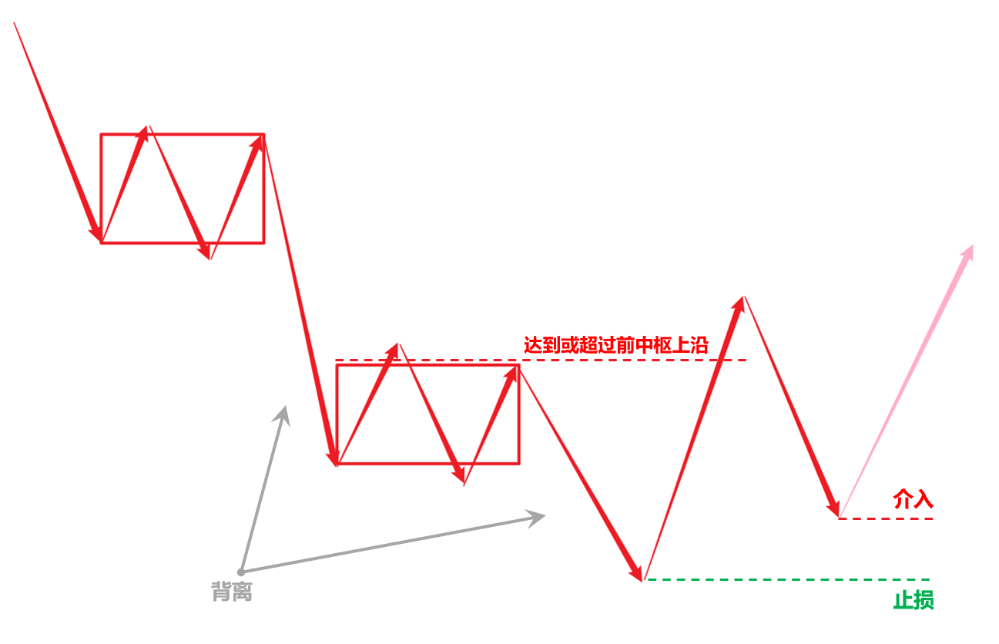

# 缠论游击战法

<small>主题：<a href="index.html">明亮</a></small>

[TOC]

## 一、游击战论

所谓游击，游是走，击是打，游而不击是逃跑主义（所以要坚决在“买点买”），击而不游是拼命主义（所以要坚决在“卖点卖”）。

合理选择作战地点（选股）、快速部署兵力（资金）、合理分配兵力（仓位）、合理选择作战时机（买入）、战斗结束迅速撤退（卖出）是游击的五项基本原则，概括为“敌进我退，敌驻我扰，敌疲我打，敌退我追”十六字诀。

 

在战争中学习战争，有时也可能会失手。失手了怎么办？“打得赢就打，打不赢就走”，保存有生力量。前途是光明的，道路是曲折的。

缠论的灵魂是段，段共有三个作用：

一、作为分解单位，同级别分解将所在级别的走势划分成同级别段连接。

二、作为操作单位，将要操做的反转笔、反弹笔转化为次级别段去操作。

三、作为判据单位，将判断本级别一笔是否走完转化为判断次级别是否成段且背离，判断本级别一段是否走完转化为判断最后一笔是否走完且背离。

以段作为分解单位，可以对反弹一笔和反转一笔完成精确定义：

**本级别上行段后的下跌一笔后反弹一笔（敌驻我扰），下行段中的下跌一笔后反弹一笔（敌驻我扰或敌疲我打），都是做反弹的目标区间。**

**本级别下行段后，反弹一笔返过平台后再跌一笔，跌一笔没有跌破前一笔，然后出反转段的第三笔（敌退我追），就是做反转的目标区间。**

<blockquote style="">
    <b>说明：</b>
    <ol>
        <li>级别序列：月→周→【<b>日</b>→<b>30分钟</b>→<b>5分钟</b>】→1分钟。</li>
        <li>跌破定义：股价小于等于，边缘碰着就算。</li>
    </ol>
</blockquote>
以段作为操作单位，操作本级别的笔要落实到操作次级别的段落上去。缠论游击战法的仓位控制原则是“**重仓做反转一笔，半仓做反弹一笔**”，无论是操作反转一笔还是反弹一笔，都是**根据本级别前一下跌笔对应的次级别下行段内包含的笔走势类型找买点进行介入**，交易节奏就是次级别跌完一个段就做次级别上涨一个段，**介入后根据当前的次级别上行段内包含的笔走势类型找卖点进行离场**。

以段作为判据单位，本级别一笔如果在次级别上也是一笔，则本级别一笔大概率没有结束。如果本级别一笔在次级别上已经形成一段，则根据段内包含的多笔形态判断分笔背离，不能确认背离则本级别一笔大概率没有结束，反之，确认分笔背离则本级别一笔大概率即将或已经结束。

判断背离选取的比较对象根据三种情况各自不同：

一、仅包含笔中枢的，对比进出最后一个中枢的两笔的形态力度和 MACD 指标值（面积、高度、黄白线）。

二、仅包含笔平台的，对比构筑最后一个平台的两笔的形态力度和 MACD 指标值（面积、高度、黄白线）。

三、同时包含笔中枢和笔平台的，同时对比进出最后一个中枢的两笔和构筑最后一个平台的两笔形态力度和 MACD 指标值。

<blockquote style="">
    <b>说明：</b>
    <ol>
        <li>
背离：价格发展方向与指标运行方向相反，一般采用MACD指标背离。

顶背离：价格创出新高，指标（面积、高度、黄白线）未创新高。

底背离：价格创出新低，指标（面积、高度、黄白线）未创新低。
</li>
        <li>
背离的前提是击穿，没有击穿就没有背离，可反复震荡，至猴年马月。

当下的背离不一定是真的背离，判断背离前提是当下这一笔已经走完，如果该笔尚未结束，继续延续则可能将背离打没。
</li>
    </ol>
</blockquote>

做股票就是两种盈利模式：做反弹和做反转，操作的都是日线一笔（30分钟一段）。相比于反转一笔，反弹一笔出现的次数更多，但是不太稳定：一是可能速度极快不及反应，二是上方利润空间普遍偏小，三是延续破前高的可能性低。所以，尽量做个股的反转一笔，避免做个股的反弹一笔是更加稳妥的方案，即打游击尽量打“敌退我追”的仗，避免打“敌驻我扰”的仗。然而，想要在5000多个战场中总能找到正在退兵以追击的部队并不容易，但因为后期我军装备了“笔段雷达”，这种只打“敌退我追”的仗的战略构想已经可以实现。所以，缠论游击战法的总战略方针是：只做日线反转一笔（30分钟反转一段）！能追到哪里就追到哪里，给多少战利就要多少战利，封狼居胥，祁山止步，都是天意，都是市场就要这么走，不可逆势强动，不可逆天强行。逆天强行就是击而不游，那就不是游击战。

做反转一笔理论上是可以重仓的，但也要考虑整个战局的走向。上证指数（大盘）是用来看整个战局的，打游击首先要学会的就是要能根据大的战局走向采用不同的仓位作战。即便我们只做个股的反转，但叠加外部环境的影响，也要在在大盘反弹的时候半仓，反转的时候重仓，其他的时候空仓不做才是比较好的策略。游击战的核心思想是以小搏大，以更小的预期损失换取更大的预期收益，决定做时也要考虑盈利比（而不是只考虑胜率），想防守要用仓位去防守，而不是用板块去防守，即防守是不战或者使用小股部队作战，而不是调遣大部队都到所谓的“避风港湾”，那样反而非常有可能会被聚歼。

游击战的作战流程：观察战局，锁定取敌，伺机出击，伺机撤离。炒股就是“看”和“干”，就是观察、操作，根本不涉及预测的事，市场不能预测也无需预测，只需要完全分类，然后跟随之不测而测。

## 二、观察战局

使用“实时倍镜”观察大盘走势，结合使用日线和30分钟级别，确认当前大盘是否处于反弹或反转，确定操作仓位。

## 三、锁定取敌

使用“笔段雷达”扫描全部品种，选出符合“**日线跌一段，涨一笔返平台，跌一笔不破前低**”的全部特征品种。

将日线最后一个下跌笔，对应放大到30分钟级别观察是否成段，不成段则排除，成段甚至成多段，则根据该日线下跌笔对应的30分钟下行段或下行多段内包含的全部笔走势类型，寻找买点、压上仓位、果断出击、伺机撤离。

## 四、伺机出击

### 1 “平台”做法

进出前平台的两笔背离，反弹一笔超过前平台上沿，形成中枢并在中枢上方形成三买后介入，在中枢上沿设止损，从30分钟反转一笔开始做30分钟反转一段。

 

反弹一笔如未超过前平台上沿，则形成第一个中枢，后续可以继续破低形成盘整走势，还可以一直震荡下去，所以没有介入机会。

 

反弹一笔如超过了前平台上沿但未形成三买，则只是中枢震荡，此处没有买点，二买的判断以一买为前提，没有一买就没有二买。

> 注意：买点的判断要靠当下直观，有就是有，没有就是没有，不能靠妄想未来，妄想未来就是贪婪和恐惧在作祟。

 

### 2 “盘整”做法

进出前中枢的两笔背离，反弹一笔达到或超过前中枢下沿，再接下跌一笔结束不破前笔低点介入，在前低设止损，从30分钟反转一笔开始做30分钟反转一段。

 

反弹一笔如未达到前中枢下沿，则形成相对于前中枢的三卖，后续可以继续破低形成平台，还可以一直震荡下去，或者构筑第二个中枢再破低形成下跌走势，都没有介入机会。

 

除非后续不破低，则等在第二个中枢上方形成三买后介入，在第二个中枢的上沿设止损，继续向上做30分钟反转一段。

 

### 3 “盘整+平台”做法

进出前中枢的两笔背离，进出前平台的两笔背离，反弹一笔达到或超过前平台上沿，再接下跌一笔结束不破前笔低点介入，在前低设止损，从30分钟反转一笔开始做30分钟反转一段。

 

反弹一笔如未达到前平台上沿，则形成第二个中枢，后续可以继续破低形成下跌走势，还可以一直震荡下去，所以没有介入机会。

 

除非后续不破低，则等在第二个中枢上方形成三买后介入，在第二个中枢的上沿设止损，继续向上做30分钟反转一段。

 

### 4 “趋势”做法

进出前中枢的两笔背离，反弹一笔达到或超过前中枢上沿，再接下跌一笔结束不破前笔低点介入，在前低设止损，从30分钟反转一笔开始做30分钟反转一段。

> 注意：趋势包含的必须是两个同级别的中枢，即中枢间不能有瞬间波动的重叠，且各中枢区间内震荡不能超过9笔，否则就只能视为更大级别的盘整，需要到更高的级别去操作。

 

反弹一笔如未达到前中枢上沿，则只能视为第二个中枢的震荡，中枢震荡可以一直继续下去，所以此处没有买点。后续还可能继续破低形成第三个中枢（小概率事件），所以暂时没有介入机会。

 

除非后续不破低，则等在第二个中枢上方形成三买后介入，在第二个中枢的上沿设止损，继续向上做30分钟反转一段。

 

### 5 “趋势+平台”做法

进出前中枢的两笔背离，进出前平台的两笔背离，反弹一笔达到或超过前平台上沿介入做一买，在前低设止损，从30分钟反弹一笔开始做30分钟反转一段。未达到前平台上沿等再接下跌一笔结束不破前笔低点介入做二买，在前低设止损，从30分钟反转一笔开始做30分钟反转一段。

> 注意：趋势包含的必须是两个同级别的中枢，即中枢间不能有瞬间波动的重叠，且各中枢区间内震荡不能超过9笔，否则就只能视为更大级别的盘整，需要到更高的级别去操作。

 

## 五、伺机撤离

介入后考虑的就是卖点的问题，根据30分钟级别当前的上行段内包含的全部笔走势类型，寻找卖点、带走仓位、果断撤离、换股操作。

### 1 “第一笔”做法

 

### 2 “第二笔”做法

 

### 3 “盘整背离”做法

 

### 3 “盘背+三买”做法

 

### 4 “趋势”做法

 

## 六、持续游击

每个交易日，上午9:30~11:30（2小时），下午13:00~15:00（2小时），可交易时间共4个小时。

从日线上看，30分钟反转一段对应日线反转一笔，日线一笔快的话2~5天，平均5~8天，最慢8~10天也差不多了。而大多数时候，做30分钟反转一段往往要落实到操作30分钟级别二买介入，介入后即只剩下最后一笔可做，一旦该笔突破前高，则30分钟宣告反转成段，就要伺机撤离了。而30分钟一笔，30min\*5=150min=2.5h，最短隔天就要出。

如以此节奏方法，能保证每周3%~5%的稳定盈利，每月10%的稳定盈利，年翻一倍就不是梦想。

 

（完）
